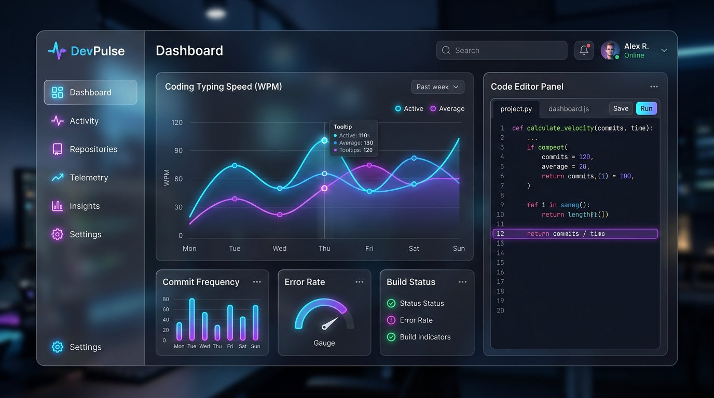

# ⚡ DevPulse: Developer Telemetry & Productivity Platform

[](https://www.oracle.com/java/)
[](https://spring.io/projects/spring-boot)
[](https://sqlite.org/)
[](LICENSE)
[](https://render.com/deploy?repo=https://github.com/RidhimaSharma11404/devpulse)

DevPulse is a state-of-the-art, cloud-native Java Full-Stack developer telemetry platform. It tracks real-time coding metrics, typing speed (WPM), and compile diagnostics via WebSockets, provides an isolated process compilation sandbox, and integrates a hybrid AI engine to generate daily standups and static code complexity reports.

---

## 🎨 Dashboard Preview



---

## 🔗 Live Application Link

* **Live Cloud Deployment**: [Launch DevPulse on Render](https://devpulse-ridhimasharma.onrender.com) *(Or your specific Render URL)*
* **GitHub Repository**: [https://github.com/RidhimaSharma11404/devpulse](https://github.com/RidhimaSharma11404/devpulse)

---

## 🚀 One-Click Deploy to Cloud

Deploy your own live instance of DevPulse in less than 60 seconds:
1. Click the **Deploy to Render** button at the top of this README.
2. Sign in with GitHub.
3. Click **Deploy Web Service**.

---

## 🛠️ Key Architectural Highlights

### 1. Low-Overhead WebSocket Telemetry
Unlike bloated frameworks, DevPulse uses raw Spring `TextWebSocketHandler` endpoints coupled with browser-native JavaScript WebSockets to stream high-frequency keyboard events. Typing speeds (WPM) are calculated on the client side using a custom Exponential Moving Average (EMA) to smooth out typing spikes before streaming.

### 2. Isolated Process Sandbox
To prevent standard security risks (such as infinite loops or `System.exit(0)` commands crashing the main server), the execution sandbox compiles Java source files dynamically using `ProcessBuilder` and spawns isolated JVM sub-processes. All outputs (stdout/stderr) are captured via concurrent stream readers, with a hard 4-second timeout enforcing clean resource teardown.

### 3. Dual-Tier Heuristic & LLM AI Engine
Features a hybrid controller design:
* **OpenAI GPT-4 Integration**: Detects active environment API keys to send processed logs for natural language summaries.
* **Local Heuristics Engine**: Offline fallback that performs real-time static code reviews, parsing Java source code structure for method length, deep nesting depth (cognitive complexity), generic exception catching, and logger quality.

---

## 📊 Database Schema

DevPulse uses an embedded relational **SQLite** database managed via **Spring Data JPA & Hibernate**:

```
+--------------------+      +--------------------+      +--------------------+
|  TelemetrySession  |      |   TelemetryEvent   |      |    CompileEvent    |
+--------------------+      +--------------------+      +--------------------+
| id (PK)            |      | id (PK)            |      | id (PK)            |
| sessionToken (UQ)  |<----+| sessionToken (FK)  |      | sessionToken (FK)  |
| startTime          |      | timestamp          |      | timestamp          |
| endTime            |      | keystrokeCount     |      | language           |
| totalKeystrokes    |      | typingSpeedWpm     |      | success (Boolean)  |
| activeTimeSeconds  |      | activeFileExt      |      | errorMessage       |
+--------------------+      +--------------------+      +--------------------+
```

---

## 🖥️ Getting Started (Local Development)

### Prerequisites
* **Java 21 JDK** installed.

### Run via Shell Launcher
Run the built-in Windows startup script:
```bash
.\run.cmd
```
*This script checks for Maven, automatically downloads and configures it locally if missing, compiles the application, runs migrations, and launches the server.*

Open your web browser and navigate to **http://localhost:8080**.

---

## 🐳 Containerized Run (Docker)

To run the application inside a container:
```bash
# Build the image
docker build -t devpulse .

# Run the container
docker run -p 8080:8080 devpulse
```
